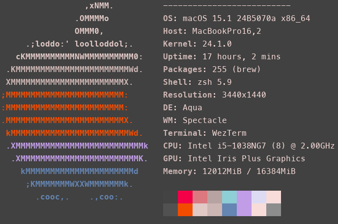

# Seoul CatPine Theme for Vim, Neovim, VSCode, and WezTerm

**Seoul CatPine** is a dark theme designed for Vim, Neovim, VSCode, WezTerm, and other tools. It provides a soothing color palette that focuses on readability and aesthetic balance, with warm pinks, cool blues, and neutral grays.

## Screenshots

## Color Palette

| Color Name | Hex Code  | Description                            |
| ---------- | --------- | -------------------------------------- |
| Background | `#4b4b4b` | Main background color                  |
| Foreground | `#f5e0dc` | Main foreground color                  |
| Keyword    | `#d78787` | Keywords like `if`, `else`             |
| Builtin    | `#c4a7e7` | Built-in functions and libraries       |
| Constant   | `#a27ea4` | Constants and enum values              |
| Comment    | `#949494` | Comments in code                       |
| Function   | `#9ccfd8` | Function and method names              |
| String     | `#e0def4` | String literals                        |
| Type       | `#718bb6` | Data types like `int`, `float`         |
| Variable   | `#c4a7e7` | Variable names                         |
| Warning    | `#e81050` | Warnings, errors, or critical messages |
| Warning 2  | `#e86310` | Less critical warnings or notices      |
